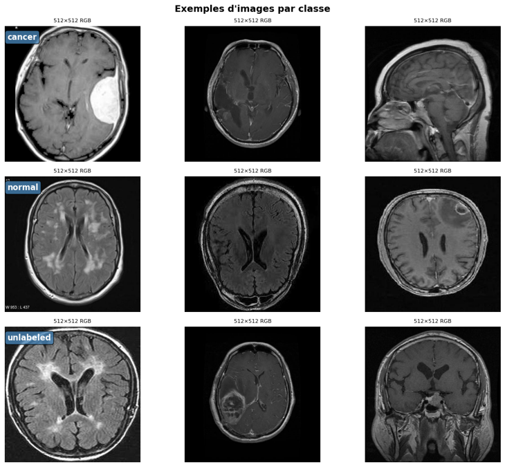
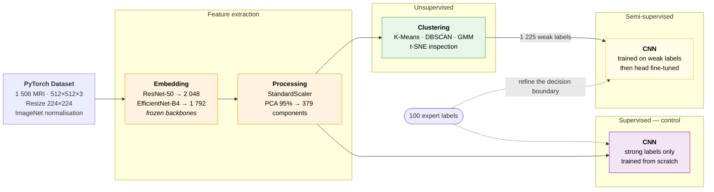
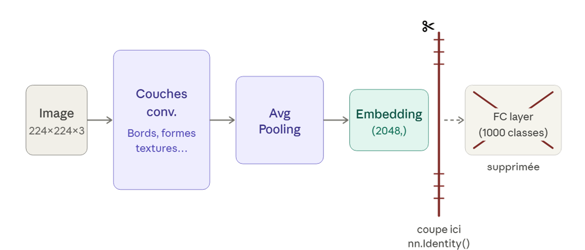
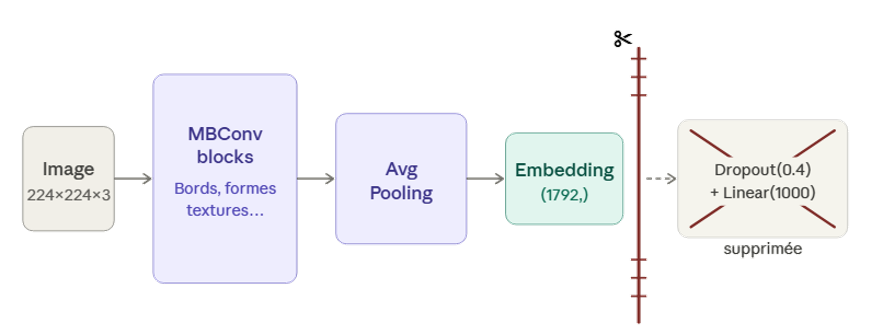
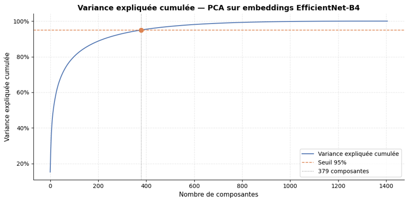
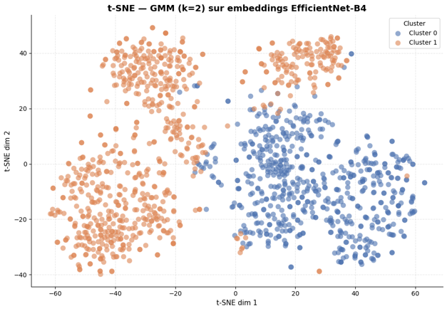
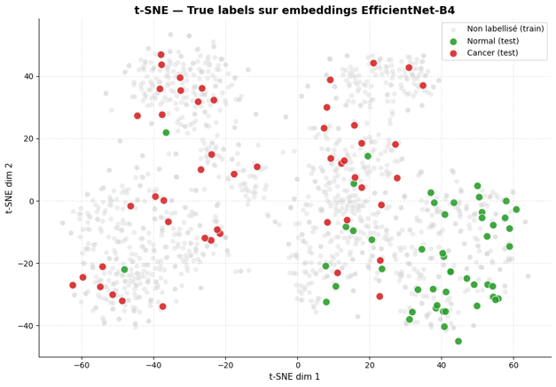
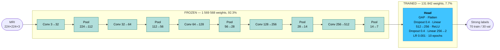

<a id="readme-top"></a>

<div align="center">

# 🧠 Brain Tumour Detection — Semi-Supervised Learning

**Label 1 406 unannotated brain MRI scans by clustering, then use those pseudo-labels
to train a CNN that beats pure supervision — on the exact same annotation budget.**

*OpenClassrooms project P7 — "Label and apply semi-supervised approaches to image processing"*

[](https://www.python.org/)
[](https://pytorch.org/)
[](https://scikit-learn.org/)
[](https://docs.astral.sh/uv/)
[](https://openclassrooms.com/)

</div>

---

## 📊 Results

Only **100 of the 1 506 MRI scans carry an expert label**. The question this project answers is
whether the 1 406 unlabelled ones can be made to count for something.

All four phases are scored on the **same held-out set of 30 expert-labelled images**.
Cancer is the positive class, so **recall** and **F2** (recall weighted ×2) outrank accuracy —
a missed tumour costs far more than a false alarm.

| Metric (%) | ① Unsupervised<br/>*GMM clusters* | ② Semi-supervised<br/>*CNN on 1 225 pseudo-labels* | ③ Semi-supervised + fine-tuning<br/>*+ 70 expert labels* | ④ Supervised<br/>*70 expert labels only* |
|:---|:---:|:---:|:---:|:---:|
| **Accuracy** | 80 | 83 | 🟢 **90** | 🔴 77 |
| **Recall** | 60 | 67 | 🟢 **87** | 🔴 80 |
| **F2** | 65 | 71 | 🟢 **88** | 🔴 79 |
| **ARI** | 34 | 43 | 🟢 **63** | 🔴 26 |

> **③ versus ④ is the whole point.** Both models see exactly the same 70 expert labels.
> The one that was first pre-trained on cluster-derived pseudo-labels wins by
> **+13 points of accuracy, +7 of recall and +37 of ARI** — for zero additional annotation.

**Pushing further.** A second study swaps the hand-rolled CNN for a pre-trained
**EfficientNet-B4** and applies three state-of-the-art SSL methods:

| Model (%) | Accuracy | Recall | F2 |
|:---|:---:|:---:|:---:|
| EfficientNet-B4 — supervised baseline | 97 | 93 | 95 |
| + Pseudo-Labeling | 97 | 93 | 95 |
| + Mean Teacher | 97 | 93 | 95 |
| **+ FixMatch** | 97 | 🟢 **100** | 🟢 **99** |

**FixMatch misses no tumour at all** on the validation set — at the cost of one extra
false alarm. In screening, that is exactly the right trade.

---

<details>
<summary>📑 Table of contents</summary>

- [Results](#-results)
- [About the project](#-about-the-project)
- [The dataset](#-the-dataset)
- [Strategy](#-strategy)
- [Pipeline](#-pipeline)
  - [1 · Exploratory analysis](#1--exploratory-analysis)
  - [2 · Feature extraction](#2--feature-extraction)
  - [3 · Unsupervised clustering](#3--unsupervised-clustering)
  - [4 · Three-phase modelling](#4--three-phase-modelling)
  - [5 · State-of-the-art SSL](#5--state-of-the-art-ssl)
- [Reading the results](#-reading-the-results)
- [Getting started](#-getting-started)
- [Repository layout](#-repository-layout)
- [Limitations](#-limitations)
- [Licence & disclaimer](#-licence--disclaimer)

</details>

## 📌 About the project

The problem is the classic one in medical imaging: **data is plentiful, annotation is not.**
1 506 brain MRI scans are available, but only 100 have been labelled by an expert.
Training a CNN on 100 images gives an unstable model; leaving the other 1 406 untouched
wastes most of the dataset.

The strategy chains all three learning regimes:

1. **Unsupervised** — cluster frozen-CNN embeddings to obtain *weak but plentiful* labels.
2. **Semi-supervised** — train a CNN on those 1 225 pseudo-labels to learn good visual
   representations.
3. **Supervised** — fine-tune only the classification head on the expert labels, to recalibrate
   the decision boundary.

The bet is that representations can be learned from noisy labels, and that scarce expert labels
are better spent on calibration than on learning from scratch. The results say the bet paid off.

## 🩻 The dataset

1 506 brain MRI scans, uniformly 512×512, RGB, JPEG.

<div align="center">
  
  <br />
  <em>The three populations. Note how little separates a tumour from healthy tissue to the
  untrained eye — and how varied the anatomical planes are.</em>
</div>

| Subset | Volume | Role |
|---|---|---|
| `data/sans_label/` | 1 406 images | Unlabelled corpus → clustering & pseudo-labels |
| `data/avec_labels/cancer/` | 50 images | Ground truth — tumour |
| `data/avec_labels/normal/` | 50 images | Ground truth — healthy |

The 100 labelled images are split **70 train / 30 validation** (stratified, `random_state=42`)
and are **never** used for clustering — an anti-leakage assertion checks for overlap between the
two populations on every run.

> [!NOTE]
> `data/`, `embeddings/`, the `.csv` artefacts and the `.pth` weights are **not versioned**.
> They are all regenerated by running the notebooks in order.

## 🧭 Strategy



## 🔬 Pipeline

### 1 · Exploratory analysis

Inventory of the 1 506 files, integrity check (every image opened with PIL, corrupted files
reported explicitly), resolution and colour-mode homogeneity, and IQR outlier detection on file
size — with every suspect image displayed for visual arbitration.

**Verdict:** a perfectly homogeneous dataset (512×512, RGB). No cleaning required.

### 2 · Feature extraction

Two ImageNet backbones are compared with **every layer frozen** (`eval()` + `no_grad()`, no
gradient descent at all): the network is used as a pure visual descriptor extractor.

<div align="center">
  
  
  <br />
  <em>Both networks are decapitated: the classification head is dropped and the pooled feature
  vector becomes the output. ResNet-50 yields 2 048 dimensions, EfficientNet-B4 yields 1 792.</em>
</div>

Shared preprocessing: `Resize(224, 224)` → `ToTensor()` → `Normalize()` with ImageNet statistics.

**Dimensionality reduction** — standardisation, then PCA at 95 % explained variance:

<div align="center">
  
  <br />
  <em>EfficientNet-B4: 1 792 dimensions collapse to <b>379 components</b> for 95 % of the
  variance. ResNet-50 needs 658 — a first argument for the former.</em>
</div>

### 3 · Unsupervised clustering

Three algorithm families, scored by ARI against the 100 labelled images:

| Algorithm | ARI | Verdict |
|---|:---:|---|
| DBSCAN | — | Rejected — no exploitable density structure in high dimension |
| K-Means (ResNet-50) | 0.24 | Rejected |
| K-Means (EfficientNet-B4) | 0.33 | Rejected — linear boundaries too rigid |
| **GMM (EfficientNet-B4)** | **0.31 → 0.35** | **Selected** — full covariances, probabilistic output |

The GMM wins less on raw score than on its **probabilistic output**: `predict_proba()` gives a
per-image confidence, which is what makes pseudo-label filtering possible downstream.

<div align="center">
  
  
  <br />
  <em><b>Left:</b> GMM with k=2 — but the map clearly shows <b>four</b> blobs, not two.
  <b>Right:</b> the same map with expert labels overlaid — cancer (red) and normal (green)
  are spread across every blob.</em>
</div>

**That contradiction is the key finding of the project.** The clustering had not separated
pathology at all — it had separated **anatomical slice planes** (axial, sagittal, coronal),
because that is the dominant visual signal. Fitting `k=4` and *then* mapping clusters onto
classes (C0 → normal, C1/C2/C3 → cancer) works *with* that latent structure instead of
fighting it.

The four optimisation rounds:

| Version | Strategy | Guiding idea |
|---|---|---|
| **V1** | GMM `k=2`, no filtering | Baseline — 1 406 raw pseudo-labels |
| **V2** | Confidence threshold on Euclidean distance to centroids | Drop the boundary points |
| **V3** | Confidence threshold via Out-Of-Fold logistic regression | Calibrated rather than geometric confidence |
| **V4** | GMM `k=4` + Out-Of-Fold Random Forest cleaning | **Final version** |

Pseudo-labels are then **cleaned by a calibrated Random Forest** (500 trees, `max_depth=12`,
`class_weight='balanced'`, Platt calibration in an inner 3-fold CV, Out-Of-Fold predictions over
a 5-fold `StratifiedKFold` — 15 fits in total): each image gets an out-of-sample confidence, and
**1 225 of the 1 406 images** clear the retained threshold.

> The Random Forest reaches **0.971 OOF accuracy** at predicting the clusters — the clusters are
> geometrically very well separated, which is what legitimises the filtering.

### 4 · Three-phase modelling

**`MyCNN`** — a hand-rolled CNN, 1 701 410 parameters: five
`Conv2d → BatchNorm2d → ReLU → MaxPool2d` blocks (32 → 512 channels, 224 px → 7 px), then
Global Average Pooling, dropout 0.4 and a two-class linear head.

**Phase 2 — semi-supervised.** Every weight is trainable; the network learns its
representations from the 1 225 weak labels.

```mermaid
flowchart LR
    IN(["MRI<br/>224×224×3"])
    B1["Conv2d 3→32<br/>3×3 · BN · ReLU"]
    P1["MaxPool<br/>224→112"]
    B2["Conv2d 32→64<br/>3×3 · BN · ReLU"]
    P2["MaxPool<br/>112→56"]
    B3["Conv2d 64→128<br/>3×3 · BN · ReLU"]
    P3["MaxPool<br/>56→28"]
    B4["Conv2d 128→256<br/>3×3 · BN · ReLU"]
    P4["MaxPool<br/>28→14"]
    B5["Conv2d 256→512<br/>3×3 · BN · ReLU"]
    P5["MaxPool<br/>14→7"]
    HEAD["<b>Head</b><br/>Global Average Pooling · Flatten<br/>Dropout 0.4 · Linear 512→256 · ReLU<br/>Dropout 0.4 · Linear 256→2"]
    OUT(["Weak labels<br/>1 225 images"])
    TRAIN["all 1 701 410 weights trainable<br/>LR 0.001 · 8 epochs"]

    IN --> B1 --> P1 --> B2 --> P2 --> B3 --> P3 --> B4 --> P4 --> B5 --> P5 --> HEAD --> OUT
    TRAIN -.- HEAD

    classDef conv fill:#E8EAF6,stroke:#3F51B5,color:#000
    classDef pool fill:#E8F5E9,stroke:#43A047,color:#000
    classDef head fill:#F3E5F5,stroke:#7B1FA2,color:#000
    classDef note fill:#FFEBEE,stroke:#C62828,color:#000
    class B1,B2,B3,B4,B5 conv
    class P1,P2,P3,P4,P5 pool
    class HEAD head
    class TRAIN note
```



**Phase 3 — fine-tuning.** The convolutional trunk is **frozen entirely**, preserving what was
learned from the pseudo-labels. Only the head's 131 842 weights — **7.7 % of the model** — are
retrained on the 70 expert labels.



Augmentation (`RandomHorizontalFlip`, `RandomRotation(15)`, `ColorJitter`) compensates for the
tiny batch. A fourth phase trains the same architecture from scratch on those same 70 labels, as
the control baseline.

**Interpretability** — a **Grad-CAM** module (forward/backward hooks, context manager guaranteeing
cleanup) produces activation maps for every model error. Validation images are displayed grouped
by confusion-matrix quadrant (TP / FN / FP / TN), which makes it legible *why* the model is wrong:
which region it was looking at when it missed a tumour.

### 5 · State-of-the-art SSL

[`notebooks/5_ssl_sota/`](notebooks/5_ssl_sota/) restarts the problem with a pre-trained
**EfficientNet-B4** (frozen backbone, only the 1792 → 2 head is trained) and three reference
semi-supervised methods. The GMM pseudo-labels are **deliberately ignored** here: all 1 406
images are treated as unlabelled, and it is up to the SSL methods to assign labels.

| Method | Principle | Reference |
|---|---|---|
| **Iterative Pseudo-Labeling** | 5 rounds: predict, keep `max(softmax) ≥ 0.95`, retrain | [Lee, 2013](https://www.researchgate.net/publication/280581078) |
| **Mean Teacher** | Student/Teacher consistency, Teacher = EMA of weights (`α=0.999`), sigmoid rampup over 10 epochs | [Tarvainen & Valpola, 2017](https://arxiv.org/abs/1703.01780) |
| **FixMatch** | Hard pseudo-label on the *weak* view if confidence ≥ 0.95, CE loss on the *strong* view (RandAugment + Cutout) | [Sohn et al., 2020](https://arxiv.org/abs/2001.07685) |

Two technical traps were found and fixed during code review, documented in
[`AVANCEMENT.md`](notebooks/5_ssl_sota/AVANCEMENT.md):

* **BatchNorm drift** — a backbone "frozen" via `requires_grad=False` still updates its *running
  stats* in `train()` mode. A `freeze_backbone_bn()` helper forces the backbone's BN layers back
  into `eval()` after every `.train()` call.
* **Buffer EMA** — Mean Teacher must propagate the EMA to BatchNorm *buffers*, not only to
  parameters, otherwise the Teacher diverges completely at evaluation time.

## 🔎 Reading the results

* **Semi-supervision pays when the backbone is weak.** With `MyCNN` trained from scratch, the
  1 225 pseudo-labels are worth +13 points of accuracy over pure supervision. With an
  ImageNet-pretrained EfficientNet-B4, the supervised baseline already reaches 97 %: the useful
  representations are *already there*, and the SSL methods have little left to add.
* **FixMatch is the only method that changes the error profile** — same accuracy as the baseline,
  but recall pushed to 100 %: no tumour missed, at the cost of one extra false alarm. In
  screening, that is the trade you want.
* **Clustering finds the structure you let it see.** The GMM separated anatomical slice planes
  before pathology — moving to `k=4` turned that "failure" into usable information.

## 🚀 Getting started

> [!IMPORTANT]
> There is no live demo for this project: it needs the 1 506 MRI images and a GPU.
> The results and figures above *are* the deliverable. Everything below is for reproducing
> them locally.

### Prerequisites

* **Python 3.12** (constraint `>=3.12,<3.14`)
* **[uv](https://docs.astral.sh/uv/)**

  ```powershell
  powershell -ExecutionPolicy ByPass -c "irm https://astral.sh/uv/install.ps1 | iex"
  ```

* **NVIDIA GPU + CUDA 12.8** *(strongly recommended)* — `pyproject.toml` points at the
  `pytorch-cu128` index. The full pipeline runs in ~45 min on an RTX 5070; CPU works but is
  markedly slower.
* The **1 506 images** placed in `data/`, following the layout described
  [above](#-the-dataset).

### Installation

```powershell
git clone https://github.com/KL38/OC_P7_DL_SSL_Brain-Tumor-Detection.git
cd OC_P7_DL_SSL_Brain-Tumor-Detection
uv sync
uv run python -c "import torch; print(torch.cuda.is_available(), torch.__version__)"
uv run jupyter lab
```

### Running order

Notebooks run **in order**, each consuming the previous one's artefacts. Every notebook opens
with a bootstrap cell that anchors it to the repository root, so it can be launched from
anywhere.

| # | Notebook | Produces | Runtime |
|---|---|---|---|
| 1 | [`1_eda.ipynb`](notebooks/1_eda.ipynb) | Exploratory analysis — no artefact | ~2 min |
| 2 | [`2_embeddings.ipynb`](notebooks/2_embeddings.ipynb) | `embeddings/*.csv` | ~5 min GPU |
| 3 | [`3_clustering_gmm_v4_final.ipynb`](notebooks/3_clustering_gmm_v4_final.ipynb) | `pseudo_labels_gmm_v4.csv`, `true_labels_test.csv` | ~10 min |
| 4 | [`4_modeling_v4_final.ipynb`](notebooks/4_modeling_v4_final.ipynb) | `model_phase{1,2}.pth`, `model_supervised.pth` | ~10 min GPU |
| 5 | [`5_ssl_sota/ssl_methods_comparison.ipynb`](notebooks/5_ssl_sota/ssl_methods_comparison.ipynb) | `checkpoints/*.pth`, `comparison_results.csv` | ~45 min GPU |

Versions `v1` → `v4` document the successive iterations and consume in pairs:
`3_clustering_gmm_vN` produces `pseudo_labels_gmm_vN.csv`, consumed by `4_modeling_vN`.
**v4 is the final version.**

## 📁 Repository layout

```text
OC_P7/
├── docs/                                   # Figures used by this README
├── notebooks/
│   ├── 1_eda.ipynb                         # 1 · Exploratory analysis
│   ├── 2_embeddings.ipynb                  # 2 · ResNet-50 & EfficientNet-B4 extraction
│   ├── 3_clustering_gmm_v1..v3.ipynb       # 3 · Clustering — iterations
│   ├── 3_clustering_gmm_v4_final.ipynb     #     k=4 + Random Forest cleaning  ★
│   ├── 4_modeling_v1..v3.ipynb             # 4 · Three-phase CNN — iterations
│   ├── 4_modeling_v4_final.ipynb           #     final  ★
│   ├── 5_ssl_sota/
│   │   ├── ssl_methods_comparison.ipynb    # 5 · EfficientNet-B4 + SSL SOTA
│   │   ├── AVANCEMENT.md                   #     design journal & code review
│   │   └── checkpoints/                    #     weights + histories   (not versioned)
│   └── discarded/
│       └── clustering_dbscan.ipynb         # Rejected avenue, kept for the record
│
├── data/                                   # 1 506 MRI images         (not versioned)
├── embeddings/                             # Feature vectors          (not versioned)
├── pseudo_labels_gmm_v*.csv                # Pseudo-labels per round  (not versioned)
├── true_labels_test.csv                    # 100 expert labels        (not versioned)
├── model_*.pth                             # MyCNN weights            (not versioned)
└── pyproject.toml                          # Dependencies (uv)
```

> [!NOTE]
> Notebooks resolve every artefact from the **repository root**, not from their own directory —
> including the `image_path` column stored inside the CSVs. The bootstrap cell at the top of each
> notebook walks up to the folder containing `pyproject.toml` and `chdir`s there, which is what
> lets them live in `notebooks/` while every path in the code stays unchanged.

## 🚧 Limitations

> [!WARNING]
> **The validation set holds only 30 images.** Confidence intervals are wide and a 3-point gap
> corresponds to a single image. No cross-validation was run on the final split, so sensitivity
> to `random_state` is unmeasured. Finally, the frozen backbone in the SSL study mechanically
> caps what those methods can achieve, since they only ever act on the classification head.

## 📄 Licence & disclaimer

Academic work, produced as part of the OpenClassrooms *Data Scientist & Machine Learning
Engineer* path. The brain MRI dataset is distributed for **free academic use**.

> [!CAUTION]
> This is a **teaching exercise**. It has undergone no clinical validation whatsoever and must
> never be used for medical diagnosis.

<p align="right">(<a href="#readme-top">back to top</a>)</p>
